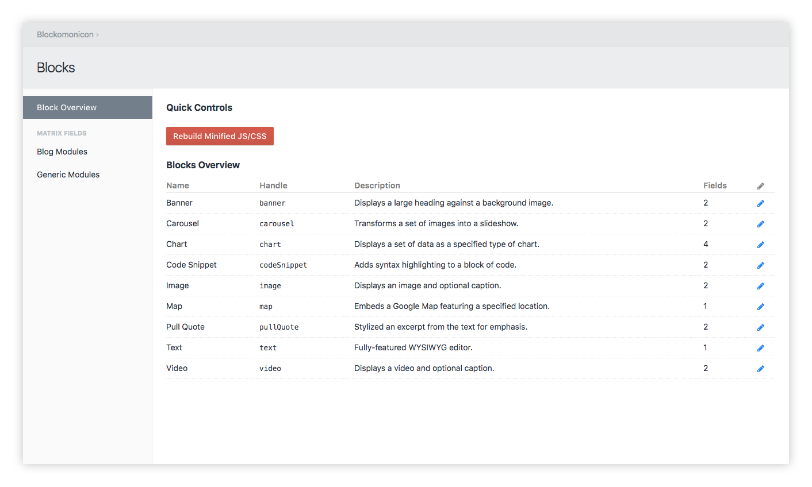
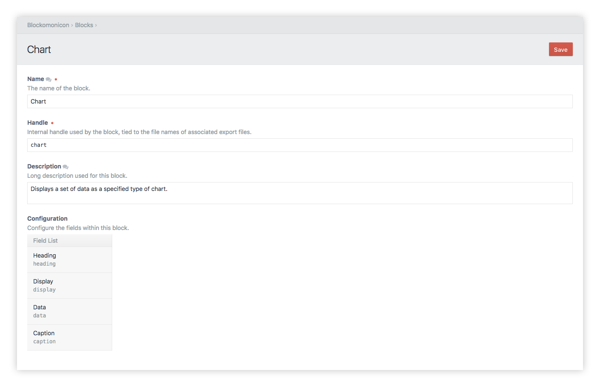
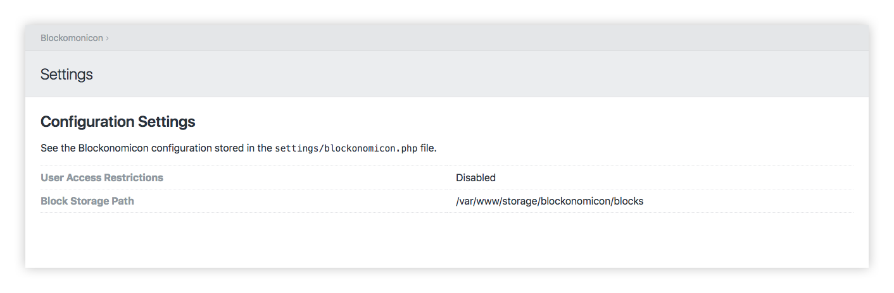
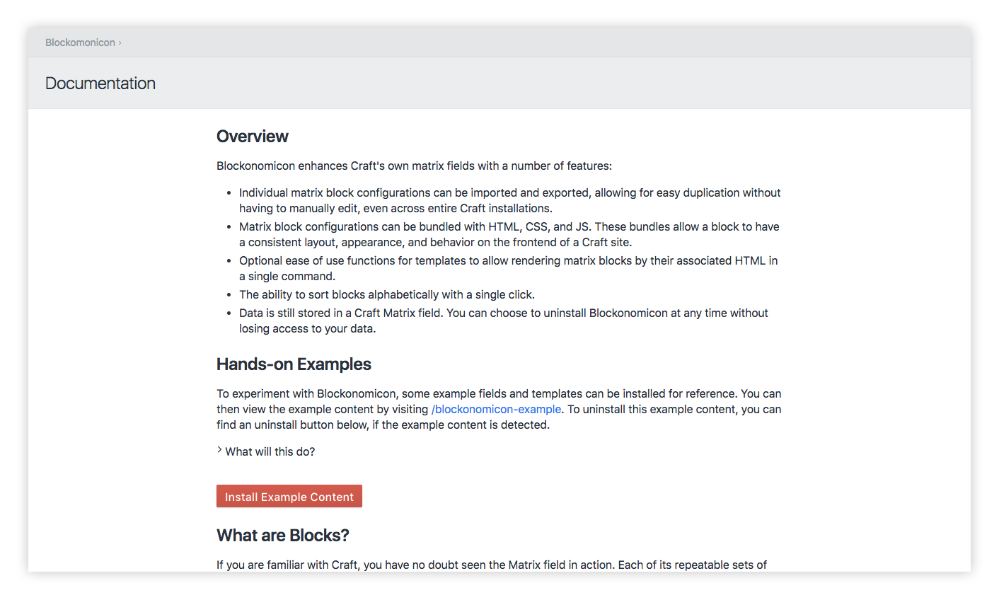

# Blockonomicon for Craft 3

This plugin enhances Craft's own matrix fields with a number of features:

- Individual matrix block configurations can be imported and exported, allowing for easy duplication without having to manually edit, even across entire Craft installations.
- Matrix block configurations can be bundled with HTML, CSS, and JS. These bundles allow a block to have a consistent layout, appearance, and behavior on the frontend of a Craft site.
- Optional ease of use functions for templates to allow rendering matrix blocks by their associated HTML in a single command.
- The ability to sort blocks alphabetically with a single click.
- Data is still stored in a Craft Matrix field. You can choose to uninstall Blockonomicon at any time without losing access to your data.

## Requirements

* Craft CMS 3.0.0-RC6 or above

## Installation

1. Open a terminal and navigate to your project folder:

```bash
cd /path/to/project
```

2. Require the package to download it via Composer:

```bash
composer require charliedev/blockonomicon
```

3. Install the plugin on the `Settings -> Plugins` page in the Craft control panel.

**--- or ---**

3. Install the plugin via the command line:

```bash
./craft install/plugin blockonomicon
```

## Usage

### Block Overview



Blockonomicon's main *block overview* section shows a listing of all exported blocks for quick reference. In the sidebar, matrix fields are listed, and choosing one will bring you to its respective editor. If an individual block needs a name or description update, there is a simple block editor that can be accessed through the edit icon of any block displayed. If there is a configuration issue with any of the installed blocks (missing configuration, bad formatting, etc.), there will be a notification in this panel as to what blocks are having trouble.

### Matrix Editor


The *matrix editor* allows the blocks on a matrix field to be freely imported, exported, and rearranged. Each block has an indicator as to whether or not it exists on the matrix, has a corresponding exported configuration file, and even if the block's configuration matches the current configuration file.

### Block Editor



The *block editor* provides a simple reference to the fields that are associated with the block, as well as a means of editing a block's name, handle, and description. To fully edit a block's individual field configurations, it is best to use the built-in matrix editor of Craft, and then re-export the (new) block. If you're feeling exceptionally adventurous, the JSON block configuration files can be manually edited.

### Settings Panel



The *settings panel* can be used to confirm a few additional settings that can be edited in a `blockonomicon.php` config file stored along with Craft's own settings.

### Additional Documentation



The plugin's section within the Craft control panel also comes with its own detailed documentation page. It includes a guide on templating features of Blockonomicon as well as a breakdown of features, management, and advanced settings. A set of example data to help in getting started with Blockonomicon can be installed through this page.

## Field Support

Blockonomicon supports all native Craft fields. Many third party fields may also be supported out of the box. An unsupported field does not prevent a block from being exported or imported. Instead if all settings cannot be saved, it may not match the exported configuration entirely when imported. Instead, for more complex fields, Blockonomicon provides an extension system that allows adapters to support these more complex fields. This extension system is used internally for Craft's element fields (Asset, Category, Entry, Tag, User).

---

*Built for [Craft CMS](https://craftcms.com/) by [Charlie Development](http://charliedev.com/)*
