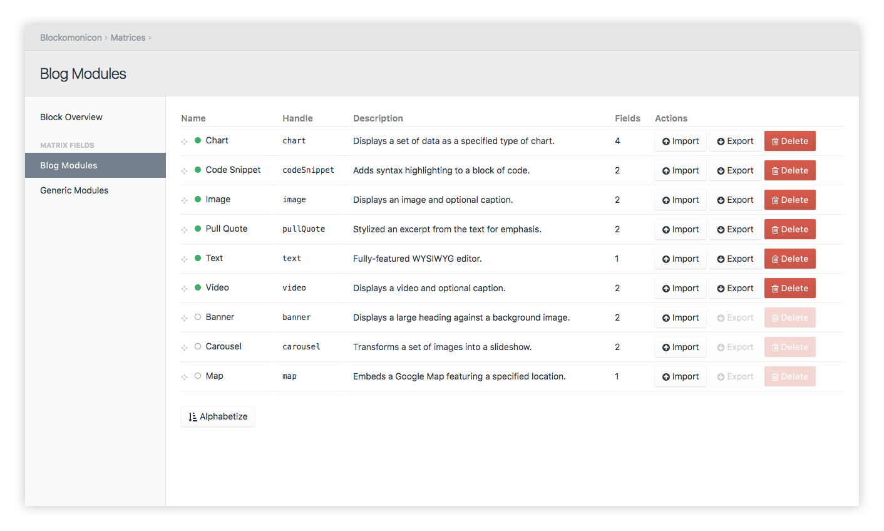

# Blockonomicon for Craft 3

This plugin enhances Craft's own matrix fields with a number of features:

- Individual matrix block configurations can be imported and exported, allowing for easy duplication without having to manually edit, even across entire Craft installations.
- Matrix block configurations can be bundled with HTML, CSS, and JS. These bundles allow a block to have a consistent layout, appearance, and behavior on the frontend of a Craft site.
- Optional ease of use functions for templates to allow rendering matrix blocks by their associated HTML in a single command.
- The ability to sort blocks alphabetically with a single click.
- Data is still stored in a Craft Matrix field. You can choose to uninstall Blockonomicon at any time without losing access to your data.

## Requirements

* Craft CMS 3.0.0-RC6 or above

## Installation

1. Open a terminal and navigate to your project folder:

```bash
cd /path/to/project
```

2. Require the package to download it via Composer:

```bash
composer require charliedev/blockonomicon
```

3. Install the plugin on the `Settings -> Plugins` page in the Craft control panel.

**--- or ---**

3. Install the plugin via the command line:

```bash
./craft install/plugin blockonomicon
```

## What are Blocks?

If you are familiar with Craft, you have no doubt seen the Matrix field in action. Each of its repeatable sets of fields is called a block. You can think of Blockonomicon's blocks as one and the same, with one main extension:

In Blockonomicon, a matrix block may be exported from a matrix field. These exported blocks, while they may be bundled with other configuration and templating files, are no different from their matrix counterparts.

## Usage

### Block Management


Blockonomicon's strongest feature is its ability to export and import block configurations. To do this, go to the *Blocks* subsection of the Blockonomicon control panel. From here you can see the *block overview* section, which a listing of all exported blocks for quick reference. In the sidebar, matrix fields are listed, and choosing one will bring you to its respective editor. If an individual block needs a name or description update, there is a simple block editor that can be accessed through the edit icon of any block displayed. If there is a configuration issue with any of the installed blocks (missing configuration, bad formatting, etc.), there will be a notification in this panel as to what blocks are having trouble.

### Matrix Editing



Selecting a matrix will shows the *matrix editor* containing a list of both the blocks already attached to the matrix and blocks that can be imported. In the matrix editor, blocks can be freely reordered, new ones may be imported into the matrix, and existing ones may be exported. Each block has an indicator as to whether or not it exists on the matrix, has a corresponding exported configuration file, and even if the block's configuration matches the current configuration file.

#### Exporting

Exporting a block saves the block's configuration to a file, and additionally creates a bundle of HTML, CSS, and JS files to go along with the block. When exporting a block that already has been exported, the configuration is backed up (as a separate `json.bak` file), and then the configuration is overwritten. Additional bundle files are not regenerated if they do not exist.

#### Importing

Importing a block creates a new block on the matrix being edited, using the fields and their respective settings from the configuration file. If being imported over an existing block, Blockonomicon will use each fields' handle to create new fields, update settings for fields that have changed, and delete any fields that no longer exist.

### Block Editing


From the *block overview*, clicking the edit icon will bring you to the *block editor*. Provided here is a simple reference to the fields that are associated with the block, as well as a means of editing a block's name, handle, and description. To fully edit a block's individual field configurations, it is best to use the built-in matrix editor of Craft, and then re-export the (new) block. If you're feeling exceptionally adventurous, the JSON block configuration files can be manually edited.

### Bundles and Templating

By default, blocks are saved to Craft's own `storage` folder, though this setting can be changed (see *Advanced Settings* below). These bundles provide not only the block's field configuration (in a json file), but also a set of HTML, CSS, and JS that may be reused alongside each block. When a block is first exported, placeholder files for these resources are created.

To use these resources in frontend templates, there are a few convenience methods you can use.

For example, if you have a matrix field as part of your current entry called `myMatrixField`, you could render each matrix block in order, using its own bundled HTML template, with the following Twig tag:

> `{{ craft.blockonomicon.renderMatrix(entry.myMatrixField) }}`

This will search for templates of exported blocks, based on each block's handle. When these templates are rendered, the `block` Twig variable is set to that block from the matrix being rendered. This means if your `myMatrixField` has as `header` plain text field, you can display it in your block template with the following:

> `{{ block.header }}`

It is possible that your blocks not only have a specific template, but also specific styling and scripting you want to use with it across a site, or even port across Craft installations. With the included CSS and JS files, these bundles can be isolated and portable. In order to generate the `<link>` tags for CSS or `<script>` tags for JS the following Twig can be used:

> `{{ craft.blockonomicon.renderCSS(options) }}`
> `{{ craft.blockonomicon.renderJS(options) }}`

By default, individual `<link>` and `<script>` tags are generated for each block, which can be useful for active development. To merge all of the block style and script files together into single JS or CSS files, pass `{condense: true}` as the `options` for each of these functions.

#### Default Bundle Files

If you need to adjust the bundled files generated by Blockonomicon, the templates used will be stored in Craft's `storage/blockonomicon` folder. The Twig template used to generate each block's HTML, CSS, and JS on export are called `base.html`, `base.css`, and `base.js` respectively.

#### Bundle Security

Keep in mind, Blockonomicon requires JSON and HTML block files to be prefixed with an underscore. This prefix causes Craft to prevent these files from being retrieved directly from the frontend.

### Custom Fields

Blockonomicon supports all native Craft fields. Many third party fields may also be supported out of the box. An unsupported field does not prevent a block from being exported or imported. Instead if all settings cannot be saved, it may not match the exported configuration entirely when imported. Instead, for more complex fields, Blockonomicon provides an extension system that allows adapters to support these more complex fields. This extension system is used internally for Craft's element fields (Asset, Category, Entry, Tag, User).

An example of an extension that allows a more complex field to be imported/exported is the [Blockonomicon Super Table Adapter](https://github.com/charliedevelopment/blockonomicon-super-table-adapter)

### Advanced Settings


Blockonomicon has special configuration settings available by editing the `blockonomicon.php` file under Craft's `config` folder. The *settings panel* can be used to confirm and review these settings.

#### `allowedUsers`

If set, users listed here (by id), are the only ones allowed to access Blockonomicon within the control panel. This is for those Craft installs where some users are admins or otherwise have permissions that would allow them access to the Blockonomicon panel, but should still be restricted.

#### `blockStorage`

This changes Blockonomicon's block configuration and template export location to a different local folder. Keep in mind that this path is registered as a template root, and files within it may be accessed through the `/blockonomicon` path on the frontend.

### In-Plugin Examples


For developer reference, Blockonomicon allows the installation of a set of example templates and data. Listed in the *examples* section is a breakdown of all data installed with the example content.

---

*Built for [Craft CMS](https://craftcms.com/) by [Charlie Development](http://charliedev.com/)*
